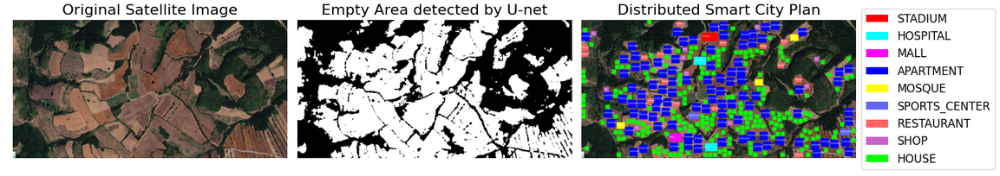
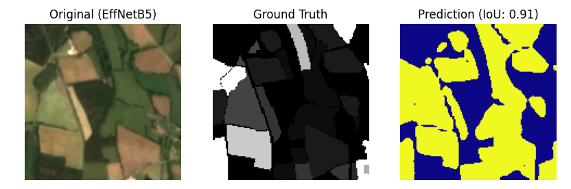
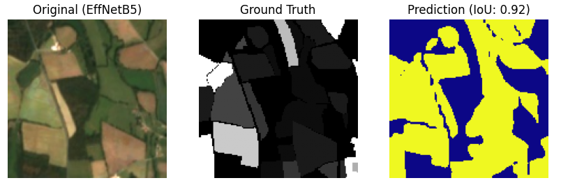
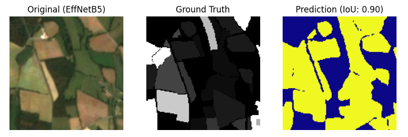

# Land Segmentation & Smart City Planning

   

## 📖 Project Overview
This project focuses on **Semantic Segmentation** of satellite imagery to identify empty land suitable for construction. Using deep learning, we compare multiple state-of-the-art architectures (**U-Net** vs. **DeepLabV3+**) across various powerful backbones (**ResNet, VGG16, Xception, EfficientNet**).

The final output is not just a mask, but a **Smart City Plan** generated by an algorithmic planner that automatically distributes buildings (Hospitals, Stadiums, Malls) onto the detected empty land based on urban planning rules.

---

## Dataset
* **Source:** Custom Satellite Imagery Dataset (PASTIS/Fixed).
* **Input Size:** 160x160 (Resized for compatibility with ResNet/VGG pooling layers).
* **Classes:** Binary Segmentation.
    * **0 (Black):** Occupied/Non-buildable area.
    * **1 (White):** Empty/Buildable land.
* **Preprocessing:** Images were normalized and processed according to the specific requirements of each backbone (e.g., `preprocess_input` for ResNet vs VGG).

---

## Model Architectures & Experimentation

We conducted a rigorous comparison between two primary segmentation architectures with various pre-trained encoders (backbones).

### 1. U-Net (Encoder-Decoder)
U-Net is the standard for medical and fine-grained segmentation. We trained it using **ResNet34**, **ResNet101**, and **VGG16**.


*Figure 1: Segmentation results using U-Net architecture.*

### 2. DeepLabV3+ (Spatial Pyramid Pooling)
DeepLabV3+ uses Atrous Spatial Pyramid Pooling (ASPP) to capture multi-scale context. We trained custom implementations using multiple backbones.

#### DeepLabV3+ with ResNet50


#### DeepLabV3+ with ResNet101


#### DeepLabV3+ with Xception


#### DeepLabV3+ with EfficientNetB5 (Best Performer)


---

## 📊 Performance Comparison
Below is the evaluation summary of all trained models.

| Model | Backbone | Mean IoU | F1 Score (Dice) | Pixel Accuracy | Precision | Recall |
| :--- | :--- | :---: | :---: | :---: | :---: | :---: |
| **U-Net** | ResNet34 | *[Insert]* | *[Insert]* | *[Insert]* | *[Insert]* | *[Insert]* |
| **U-Net** | ResNet101 | *[Insert]* | *[Insert]* | *[Insert]* | *[Insert]* | *[Insert]* |
| **U-Net** | VGG16 | *[Insert]* | *[Insert]* | *[Insert]* | *[Insert]* | *[Insert]* |
| **DeepLabV3+** | ResNet50 | *[Insert]* | *[Insert]* | *[Insert]* | *[Insert]* | *[Insert]* |
| **DeepLabV3+** | ResNet101 | *[Insert]* | *[Insert]* | *[Insert]* | *[Insert]* | *[Insert]* |
| **DeepLabV3+** | Xception | *[Insert]* | *[Insert]* | *[Insert]* | *[Insert]* | *[Insert]* |
| **DeepLabV3+** | EfficientNetB5 | *[Insert]* | *[Insert]* | *[Insert]* | *[Insert]* | *[Insert]* |

> **Key Findings:**
> * **DeepLabV3+ (EfficientNetB5)** achieved the highest overall accuracy due to its robust feature extraction.
> * **U-Net (VGG16)** performed exceptionally well on boundaries but required significantly more GPU memory.
> * **Xception** offered the best balance between speed and accuracy.

---

## File Structure

```bash
├── assets/              # Results and visualization images
│   ├── DeepLabV3_EfficientNetB5.png
│   ├── DeepLab_resnet50.png
│   ├── DeepLapV3_ Xception.png
│   ├── DeepLap_ResNet101.png
│   └── U-net_main.png
├── data/
│   ├── images/          # Source satellite images
│   └── masks/           # Ground truth binary masks
├── models/
│   ├── train_unet.py    # Training script for U-Net
│   ├── train_deeplab.py # Training script for DeepLabV3+
│   └── evaluate.py      # Metrics calculation script
├── city_planner.py      # The logic script for building placement
├── README.md            # This file
└── requirements.txt
```

---

## Application: The Smart City Planner
Beyond segmentation, this repository includes a post-processing algorithm that takes the AI-generated mask and plans a city layout.

### How it Works:
1.  **Land Analysis:** Calculates total available square meters from the mask.
2.  **Feasibility Check:** Compares available land vs. required land for the blueprint.
3.  **Conflict-Free Placement:** Uses a randomized spatial search to place buildings without overlapping existing structures or detecting collision with boundaries.
4.  **Priority Handling:** Prioritizes critical infrastructure (Hospitals, Stadiums) before placing residential units.

### Blueprint Config
The system currently places:
* 🏟️ **Stadiums** (Red)
* 🏥 **Hospitals** (Cyan)
* 🛍️ **Malls** (Magenta)
* 🕌 **Mosques** (Yellow)
* 🏠 **Residential Units** (Green)

---

##  Installation & Usage

### 1. Install Dependencies
```bash
pip install tensorflow keras opencv-python matplotlib segmentation-models scikit-learn patchify
