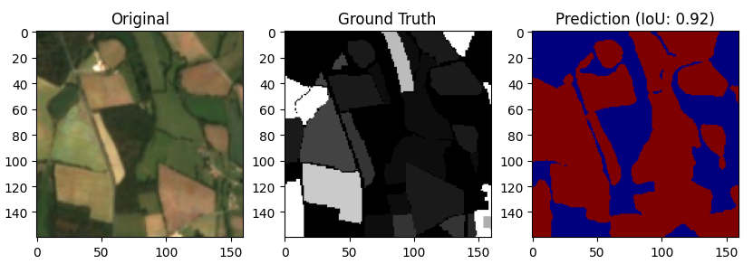
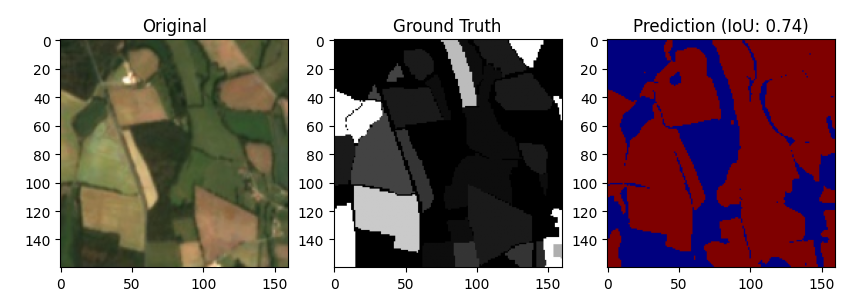
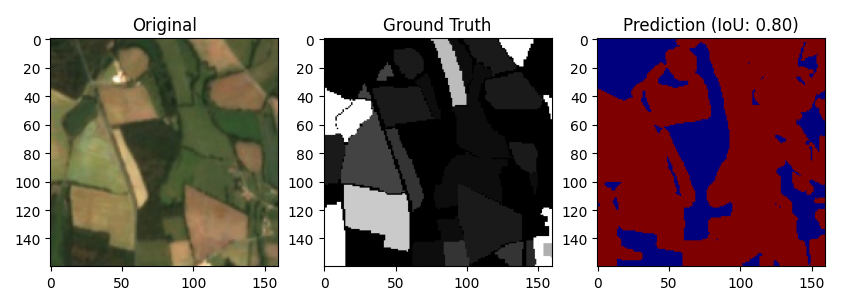

# Land Segmentation & Smart City Planning

   

## 📖 Project Overview
This project focuses on **Semantic Segmentation** of satellite imagery to identify empty land suitable for construction. Using deep learning, we compare multiple state-of-the-art architectures (**U-Net** vs. **DeepLabV3+**) across various powerful backbones (**ResNet, VGG16, Xception, EfficientNet**).

The final output is not just a mask, but a **Smart City Plan** generated by an algorithmic planner that automatically distributes buildings (Hospitals, Stadiums, Malls) onto the detected empty land based on urban planning rules.


---
## Data Preparation & Processing

### Source Data (PASTIS)
We utilized the **PASTIS dataset** (Panoptic Agricultural Satellite TIme Series). Originally designed for panoptic segmentation of agricultural parcels, the raw dataset consists of multi-spectral time series images.

### Custom Processing Pipeline
We did **not** use the raw PASTIS data directly. Instead, we engineered a custom preprocessing pipeline to convert the complex panoptic annotations into a streamlined format suitable for binary semantic segmentation (Buildable Land vs. Non-Buildable).

#### Technical Transformation Steps:
1.  **Class Filtering:** The original PASTIS labels contain multiple crop types. We aggregated these into a binary mask where:
    * **1 (Land/Void):** Represents empty agricultural parcels or barren land suitable for construction.
    * **0 (Background):** Represents occupied areas, roads, or water bodies.
2.  **Format Conversion:**
    * **Input:** Multi-channel satellite .tif files.
    * **Output:** Standardized `.npy` (Numpy) files for efficient high-speed loading. and later to `.png`
3.  **Resizing & Normalization:**
    * All patches were resized to **160x160 pixels** to ensure compatibility with the pooling layers of ResNet and VGG backbones (which require inputs divisible by 32).
    * Pixel values were normalized to the range `[0, 1]` or standardized using ImageNet mean/std (depending on the backbone requirements).

### Final Data Structure
The processed data is stored in a structured format for the data loader:
* `X_train.png`: Tensor of shape `(N, 160, 160, 3)` containing RGB satellite images.
* `Y_train.png`: Tensor of shape `(N, 160, 160, 1)` containing binary ground truth masks.
---

## Model Architectures & Experimentation

We conducted a rigorous comparison between two primary segmentation architectures with various pre-trained encoders (backbones).

### 1. U-Net (Encoder-Decoder)
U-net is an image segmentation technique developed primarily for image segmentation tasks. These traits provide U-net with a high utility within the medical imaging community and have resulted in extensive adoption of U-net as the primary tool for segmentation tasks in medical imaging. The success of U-net is evident in its widespread use in nearly all major image modalities, from CT scans and MRI to X-rays and microscopy. Furthermore, while U-net is largely a segmentation tool, there have been instances of the use of U-net in other applications. Given that U-net's potential is still increasing, this narrative literature review examines the numerous developments and breakthroughs in the U-net architecture and provides observations on recent trends. We also discuss the many innovations that have advanced in deep learning and discuss how these tools facilitate U-net. In addition, we review the different image modalities and application areas that have been enhanced by U-net.
U-Net is the standard for medical and fine-grained segmentation. We trained it using **ResNet34**, **ResNet101**, and **VGG16**.


#### U-Net with ResNet101

#### U-Net with ResNet34

#### U-Net with VGG16


### 2. DeepLabV3+ (Spatial Pyramid Pooling)
Known for its precise pixel-by-pixel image segmentation skills, DeepLabV3+ is a powerful semantic segmentation model. It combines a robust feature extractor, such as ResNet50 or ResNet101, with an effective decoder. This architecture does a great job of capturing both local and global context information, which makes it suitable for tasks where accurate object boundaries and fine details are important. A crucial part is the Atrous Spatial Pyramid Pooling (ASPP) module, which uses several dilated convolutions to collect data on multiple scales. The decoder further improves the output by fusing high-level semantic features with precise spatial data. Highly precise segmentations across a variety of applications are made possible by this fusion of context and location awareness.

#### DeepLabV3+ with ResNet50


#### DeepLabV3+ with ResNet101


#### DeepLabV3+ with Xception


#### DeepLabV3+ with EfficientNetB5 (Best Performer)


---
### ResNet Backbone 

Residual Networks, often known as ResNets, are a class of deep neural network architectures created to address the vanishing gradient problem that can arise in very deep networks. They were first presented in the 2015 publication Deep Residual Learning for [Image Recognition](https://ieeexplore.ieee.org/document/7780459) by Kaiming He et al. ResNets have been extensively used for a number of tasks, including image classification, object recognition, and segmentation.

The main novelty in ResNets is the introduction of residual blocks, which allow for the training of extremely deep networks by providing shortcut connections (skip connections) that omit one or more layers. Through the use of these connections, gradients can pass directly through the network without disappearing or blowing up, enabling the training of far more complex structures.

ResNets are available in a range of depths, designated as ResNet-XX, where XX is the number of layers. The ResNet-18, ResNet-34, ResNet-50, ResNet-101, and ResNet-152 are popular variations. The performance of the deeper variations is better, but they also use up more processing resources

## 📊 Performance Comparison
Below is the evaluation summary of all trained models.

| Model | Backbone | Mean IoU | F1 Score (Dice) | Pixel Accuracy | Precision | Recall | Over All Preformance |
| :--- | :--- | :---: | :---: | :---: | :---: | :---: | :---: |
| **U-Net** | ResNet34 | *0.7248* | *0.8239* | *0.8223* | *0.7762* | *0.9034* | *0.8101* |
| **U-Net** | ResNet101 | *0.8859* | *0.9377* | *0.9368* | *0.9190* | *0.9585* |*0.9275* |
| **U-Net** | VGG16 | *0.7750* | *0.8623* | *0.8536* | *0.7909* | *0.9704* | *0.8504* |
| **DeepLabV3+** | ResNet50 | *0.8877* | *0.9392* | *0.9390* | *0.9424* | *0.9372* |*0.9291* |
| **DeepLabV3+** | ResNet101 | *0.9372* | *0.9372* | *0.9432* | *0.9363* | *0.9538* |*0.9415* |
| **DeepLabV3+** | Xception | *0.8659* | *0.9257* | *0.9261* | *0.9154* | *0.9385* |*0.9143* |
| **DeepLabV3+** | EfficientNetB5 | *0.8784* | *0.9335* | *0.9323* | *0.9210* | *0.9488* |*0.9228* |


---

## File Structure

```bash
├── assets/             
│   ├── DeepLabV3_EfficientNetB5.png
│   ├── DeepLab_resnet50.png
│   ├── DeepLapV3_ Xception.png
│   ├── DeepLap_ResNet101.png
│   └── U-net_main.png
├── data/
│   ├── images/          
│   └── masks/           
├── models/
│   ├── DeepLapv3_Xception.py
│   ├── DeepLapv3_resnet101.py
│   ├── DeepLapv3_resnet50.py 
│   ├── Deeplabv3_EfficientNetB5.py
│   ├── U-net_resnet101.py
│   ├── U-net_resnet34.py
│   ├── U-net_vgg16.py 
│   └── evaluate.py         
├── README.md            # This file
└── requirements.txt
```

---

## Application: The Smart City Planner
Beyond segmentation, this repository includes a post-processing algorithm that takes the AI-generated mask and plans a city layout.

### How it Works:
1.  **Land Analysis:** Calculates total available square meters from the mask.
2.  **Feasibility Check:** Compares available land vs. required land for the blueprint.
3.  **Conflict-Free Placement:** Uses a randomized spatial search to place buildings without overlapping existing structures or detecting collision with boundaries.
4.  **Priority Handling:** Prioritizes critical infrastructure (Hospitals, Stadiums) before placing residential units.

### Blueprint Config
The system currently places:
* 🏟️ **Stadiums** (Red)
* 🏥 **Hospitals** (Cyan)
* 🛍️ **Malls** (Magenta)
* 🏢 **Apartments** (Blue)
* 🕌 **Mosques** (Yellow)
* 🏀 **Sports Centers** (Light Blue)
* 🍽️ **Restaurants** (Light Red)
* 🏪 **Shops** (Purple)
* 🏠 **Houses** (Green)
---

## 🛠️ How to Run the Models Locally

This project contains standalone training scripts for different model architectures and backbones. Follow the steps below to train any of the models on your local machine.

### Prerequisites
Ensure you have Python installed (3.8+ recommended) and the required libraries. You can install them using:

```bash
pip install tensorflow keras opencv-python matplotlib segmentation-models scikit-learn
```

### Training Instructions

Each script is pre-configured with the optimal hyperparameters for its specific backbone. To start training, simply open your terminal in the project directory and run the command for the model you wish to use

## DeepLabV3+ Models

These models use Spatial Pyramid Pooling and are excellent for capturing multi-scale context.

### DeepLabV3+ with ResNet50:

```bash
python DeepLapv3_resnet50.py
```

### DeepLabV3+ with ResNet101: 
```bash
python DeepLapv3_resnet101.py
```

### DeepLabV3+ with Xception: 
```bash
python DeepLapv3_Xception.py
```

### DeepLabV3+ with EfficientNetB5: 
```bash
python Deeplabv3_EfficientNetB5.py
```

## U-Net Models

These models use a standard Encoder-Decoder architecture and are highly effective for precise boundary detection.

### U-Net with VGG16: (High texture retention)
```bash
python U-net_vgg16.py
```

### U-Net with ResNet34: 
```bash
python U-net_resnet34.py
```

### U-Net with ResNet101:

```bash
python U-net_resnet101.py
```


req 

authors 
n
dr


aqnolag
https://arxiv.org/pdf/1505.04597
https://ieeexplore.ieee.org/document/7780459
https://ieeexplore.ieee.org/document/9446143
https://github.com/mukund-ks/DeepLabV3-Segmentation
